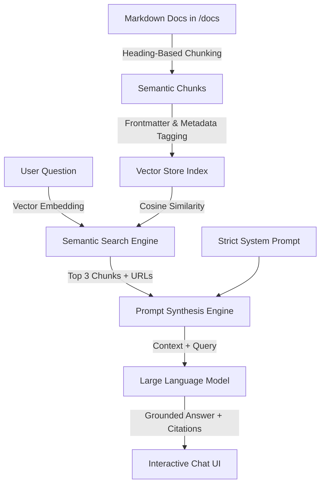

# ⚡ Stripe AI Documentation Assistant & RAG Architecture
> **A Technical Writing & AI Engineering Portfolio Case Study**  
> *Bridging Docs-as-Code, Information Architecture, and Retrieval-Augmented Generation.*

---

## 📌 Executive Summary

Modern software development teams struggle with information retrieval. As API documentation grows, traditional keyword search often fails because developers describe symptoms (e.g., *"error 401 unauthorized"*) rather than formal product terminology (e.g., *"HTTP Bearer Authentication Configuration"*).

This project demonstrates how **structured technical documentation** combined with **Retrieval-Augmented Generation (RAG)** provides instant, hallucination-free answers with direct citations back to the source documentation.

---

## 🏗️ System Architecture



---

## ✍️ The Technical Writer's Superpower in AI Systems

Many AI projects fail not because of weak machine learning models, but because of **poor source data**. This project highlights the four critical technical writing skills required for production AI:

| Technical Writing Discipline | Impact on RAG System |
| :--- | :--- |
| **Heading-Based Chunking (`H2`/`H3`)** | Ensures chunks represent self-contained conceptual tasks rather than fragmented paragraphs cut off by arbitrary character counts. |
| **Frontmatter & Taxonomy Management** | Injects URL slugs, section anchors, and tags into each chunk so the assistant can provide direct, clickable citations. |
| **Explicit Terminology & Context** | Eliminates ambiguous pronouns (*"click it to run that"*), ensuring vector embeddings capture accurate semantic relationships. |
| **Prompt Engineering & Tone Guardrails** | Defines strict boundaries requiring the AI to admit when an answer is not present rather than hallucinating instructions. |

---

## 🚀 Quick Start Guide

### Prerequisites
- **Node.js** (v18 or higher)
- **npm**

### 1. Installation
Clone the repository and install the lightweight dependencies:
```bash
git clone <your-repo-url>
cd stripe-ai-doc-assistant
npm install
```

### 2. Index Documentation
Parse the Markdown files in `/docs` and build the semantic vector index:
```bash
npm run index-docs
```

### 3. Launch the Application
Start the local server:
```bash
npm start
```
Open your browser and navigate to:
* **Interactive Chat Assistant**: [http://localhost:3000](http://localhost:3000)
* **Visual Educational Guide**: [http://localhost:3000/encyclopedia](http://localhost:3000/encyclopedia)

---

## 📂 Project Structure

```
.
├── ai_docs_encyclopedia.html    # Standalone interactive educational guide & glossary
├── docs/                        # Curated Stripe API documentation in Markdown
│   ├── authentication.md        # API keys, Bearer headers, security
│   ├── payment_intents.md       # Payment lifecycles, 3D Secure, zero-decimal currencies
│   ├── webhooks.md              # Event handling, signature verification (whsec_)
│   ├── customers.md             # Customer objects, off-session charging
│   ├── refunds.md               # Full & partial refunds, dispute handling
│   ├── errors_and_debugging.md  # HTTP status codes, decline codes, idempotency
│   └── testing_and_cards.md     # Test cards (4242...), 3DS simulations, CLI
├── src/
│   ├── indexer.js               # Markdown parser & heading-based chunker
│   ├── search.js                # Semantic search & vector cosine similarity
│   └── rag.js                   # Prompt template builder & response orchestrator
├── public/                      # Web application front-end
│   ├── index.html               # Main UI layout
│   ├── app.js                   # Client controller & Markdown renderer
│   └── styles.css               # Modern slate/indigo styling
├── server.js                    # Express application server & API routes
└── package.json                 # Scripts and dependencies
```

---

## 🔍 How to Test the Assistant

Try asking the assistant real developer questions:

1. **Authentication**: *"How do I authenticate requests to the Stripe API?"*
2. **Lifecycle**: *"What are the states a PaymentIntent goes through before succeeding?"*
3. **Webhooks**: *"Why do I need the raw body buffer when verifying webhook signatures?"*
4. **Sandbox**: *"What card number can I use to test a 3D Secure authentication challenge?"*
5. **Edge Cases**: *"How do I prevent double charges if a user clicks pay twice?"*

---

## 📄 License & Attribution
Designed by **Technical Writing Architecture**. Licensed under MIT.
